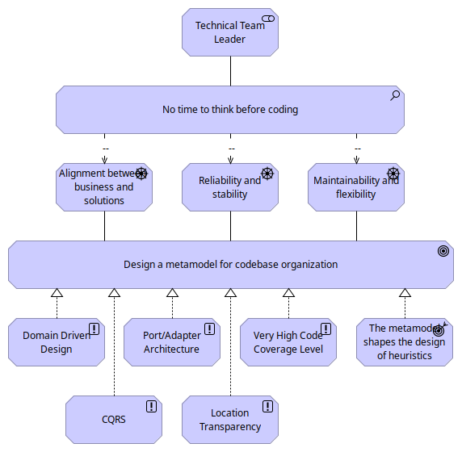

= Enterprise Application: a metamodel to streamline codebase organization
:author: Thibault Morin
:revdate: 2024-04-13
:revnumber: 3
:toc:
:icons: font
:source-highlighter: coderay
:doctype: article
:description: A metamodel to streamline the thought processes involved in organizing a code base.
:copyright: CC BY 4.0

[abstract]
== Abstract

The article presents a metamodel of a codebase organization to streamline the thought processes involved in the development of enterprise applications. The metamodel is based on Domain Driven Design, Ports and Adapters Architecture, Command and Query Responsibility Segregation, and Location Transparency. It aims to solve prevalent issues in software development such as ensuring business alignment with solutions, enhancing solution reliability and stability, and improving the codebase's maintainability and flexibility. Finally, the article provides an exploration of the metamodel usage through practical application examples.

== The motivation

In the fast-paced world of software development, agility has become the guiding principle for teams seeking to innovate and deliver value swiftly. This approach emphasizes rapid development cycles, where features are rolled out incrementally, allowing for quick delivery and early feedback. The agility model has revolutionized the software development process, enhancing efficiency and adaptability. Yet, this very model introduces unique challenges, particularly in the realm of custom solutions for enterprise applications. The inherent complexity of these applications does not seamlessly align with the agility paradigm, where rapid and incremental changes are the norms. Such complexity demands thoughtful consideration and time — commodities often in short supply in agile environments.

Despite these challenges, a well-considered approach to software development can significantly streamline the process, even within the intricate landscape of enterprise applications. Embracing heuristics and a mindset of acceptance towards the limitations of time allows us to navigate the complexities more effectively. However, the quest for a one-size-fits-all solution to address these complexities is futile. Solutions are inherently contextual, and a universal strategy that addresses all concerns is, at best, hypothetical.

This article explores the complexities of structuring a codebase for creating bespoke solutions in enterprise applications. Drawing on my 15 years of experience focused on custom solutions with long-term projects, I suggest a metamodel that facilitates the design of heuristics to simplify the thought processes.

At the core of the metamodel are principles such as Domain Driven Design, the Port/Adapter Architecture, Command and Query Responsibility Segregation, and Location Transparency, all underpinned by a commitment to high code coverage. Together, these elements form the cornerstone of a codebase that not only meets the immediate demands of agility but also addresses the broader concerns of aligning with business goals, ensuring reliability, and maintaining flexibility.

The following Archimate Motivation View is a good way to visualize the reasoning behind this proposal.

.Archimate Motivation View

== The concerns

When embarking into the creation and management of a codebase for enterprise applications several key concerns arise. These concerns are pivotal to the success of the organization, influencing not only the initial development phase but also the long-term viability and adaptability of the solutions crafted. Let's delve into these critical areas.

=== Alignment Between the Business and the Solutions

One of the paramount challenges in the development of enterprise applications is ensuring that the final solutions aligns closely with business requirements and objectives. This alignment is not just a desirable attribute but a fundamental necessity for the success of any enterprise. Unfortunately, as many seasoned IT professionals can attest, discrepancies between business expectations and the implemented solutions are not uncommon. These discrepancies can range from minor issues, such as terminology misalignment and business rule misinterpretations, to more significant concerns like flawed data model designs. Such misalignment not only result in financial losses but can also erode the trust between IT service providers, stakeholders, and shareholders, ultimately impacting the project's overall success and the organization's reputation.

=== Reliability and Stability of the Solutions

Reliability and stability are the bedrocks upon which enterprise applications should be built. These characteristics ensure that solutions perform consistently under expected conditions and possesses the resilience needed to withstand unexpected situations. Drawing from my own experience, as well as the collective wisdom of the IT community, it's clear that failing to meet these criteria—evidenced by solutions that does not pass User Acceptance Testing (UAT) or falters under unforeseen circumstances—can have dire consequences. These include not just immediate financial losses, but also long-term reputational damage and potential legal ramifications, all of which can significantly set back an organization's progress.

=== Maintainability and Flexibility of the Codebase

The maintainability and flexibility of a codebase are crucial for the long-term health and scalability of solutions. A well-organized codebase enables developers to understand, modify, and extend the software efficiently, thereby adapting to new requirements or addressing issues as they arise. In contrast, a codebase that resembles a "nightmare"—difficult to decipher, modify, or expand—poses numerous challenges. It can lead to regression bugs, performance bottlenecks, and security vulnerabilities. Moreover, a poorly maintained codebase can affect team morale, diminish job satisfaction, and hinder an organization's ability to attract and retain talent. Ensuring that the codebase remains clean, well-documented, and adherent to best practices is not just a technical requirement but a strategic imperative for fostering innovation and maintaining competitive edge.

In summary, the organization of a codebase for enterprise applications must address these critical concerns with diligence and foresight. By prioritizing alignment with the domain, reliability, stability, maintainability and flexibility, developers can lay a solid foundation for solutions that not only meets today's challenges but is also poised to tackle tomorrow's opportunities.

== The drivers

In the journey of crafting a robust codebase for custom enterprise solutions, several key drivers pave the way for addressing common concerns while fostering innovation and efficiency. Let's dive into these drivers, sharing insights from a personal perspective on how they contribute significantly to overcoming the challenges identified in the earlier sections.

=== Domain Driven Design (DDD)

Domain-Driven Design (DDD) <<ddd>> is a sophisticated approach to software development that prioritizes the core logic and functionality of the business domain it aims to serve. The essence of DDD lies in its focus on understanding the business domain deeply and modeling software that reflects this understanding, thereby bridging the gap between technical implementation and business strategy. This methodology is particularly beneficial in complex domains where the business rules and processes are intricate and subject to frequent changes.

In my opinion, DDD is an excellent strategy for thoughtful coding, which is crucial in the creation of complex solutions. It offers valuable tools such as the ubiquitous language, strategic patterns, and tactical patterns.

From my point of view, Domain Driven Development helps to fulfilled the following patterns concerns:

- Alignment between the business and implemented solutions: Encourages focus on the core business logic, keeping it separate from external concerns.
- Reliability and stability of the solutions: Reduces dependencies on external systems and technologies, which can enhance stability.
- Maintainability and flexibility of the codebase: Makes the application easier to test, maintain, and adapt to new requirements or technologies.

=== Ports and Adapters Architecture

The Ports and Adapters Architecture <<hexa>>, also known as the Hexagonal Architecture, divides an application into loosely connected components. This division allows the core application to remain unaffected by external technologies and services.

From my viewpoint, the Ports and Adapters Architecture is an exemplary method for devising and managing complex systems. It introduces valuable concepts like the Hexagon, Ports, and Adapters, which steer clear of entangled code and preserve the integrity of the core business logic from external interferences.

This architectural style complements the Domain-Driven Design (DDD) approach seamlessly. For instance, a DDD Module could correspond to a Hexagon, a DDD Repository might act as a Port, and the Repository's implementation could serve as an Adapter.

I believe the Ports and Adapters Architecture effectively addresses the following concerns:

- Aligning business goals with implemented solutions: It emphasizes the importance of concentrating on core business logic while isolating it from external distractions.
- Enhancing the reliability and stability of solutions: By minimizing dependencies on external systems and technologies, it contributes to overall system stability.
- Improving maintainability and adaptability of the codebase: The architecture simplifies testing, maintenance, and the integration of new requirements or technologies.

=== Command and Query Responsibility Segregation (CQRS)

The Command and Query Responsibility Segregation (CQRS) pattern <<cqrs>> is a strategic approach that delineates data operations into two distinct categories: queries for reading data and commands for updating it. This division promotes a more streamlined and efficient process for managing data interactions.

I view CQRS as a highly effective framework, particularly within the fast-paced, agile development environment where time is a critical factor. Considering commands and queries separately when planning the implementation of a feature facilitates a thorough evaluation and estimation of the feature's impact on both the data and the system as a whole.

From my perspective, CQRS addresses the following concerns:

- Alignment between the business and implemented solutions: Encourages a clear separation of concerns, making it easier to understand and implement business logic.
- Reliability and stability of the solutions: By separating reads and writes, CQRS can improve performance and reduce the risk of data corruption.
- Maintainability and flexibility of the codebase: CQRS allows for scalability and simplicity in the data management, making them easier to maintain and evolve.

=== Location Transparency

Location Transparency <<loctra>> is a principle that enables software components to interact seamlessly without being aware of each other's physical location on the network. This concept fosters decoupling and enhances scalability.

I regard Location Transparency as an excellent strategy for avoiding tight coupling between components, such as the hexagons in the Ports and Adapters Architecture, and for simplifying integrations. Essentially, for any given hexagon, we can establish a contract (i.e., a port) and the implementation of a client (i.e., an adapter) that other hexagons can utilize. This client might employ remote communication methods like REST, AMQP, gRPC, or even local communication strategies such as Inversion of Control or in-process communication.

In my view, Location Transparency addresses the following concerns effectively:

- Reliability and stability of the solutions: Enhances the system’s ability to recover from failures and balance loads effectively.
- Maintainability and flexibility of the codebase: Facilitates easier changes and deployments, as components can be moved or scaled independently.

=== Very High Code Coverage Level

Maintaining a very high level of code coverage is a demanding requirement that pushes developers to write detailed tests for virtually every segment of the code. This demand not only challenges developers to deeply consider the architecture and testability of their code from the beginning but also instills a rigorous discipline in the development process.

While the task of writing tests (unit, integration, end-to-end, performance ...) may initially seem tedious, my experience suggests that a higher code coverage level significantly enhances the quality of the codebase, particularly in terms of its reliability and stability. The stringent requirement for high code coverage serves as a powerful incentive for developers to produce code that is inherently testable.

Furthermore, this constraint often leads to the exploration and adoption of best practices, such as adherence to the SOLID principles and the implementation of Test-Driven Development (TDD). I am convinced that a codebase designed to be easily testable and built upon such best practices is inherently more maintainable and adaptable. In other words, it tends to be well-structured, well-documented, and well-understood ...

From my perspective, enforcing a very high code coverage level addresses the following concerns:

- Reliability and stability of the solutions: High code coverage ensures thorough testing, leading to software that is more reliable and stable, as more code paths are verified against errors and regressions.
- Maintainability and flexibility of the codebase: The constraint of high code coverage guides developers towards better coding practices which ultimately results in a codebase that is easier to maintain and adapt, e.g. the SOLID principles, the Test-Driven Development (TDD) approach …

== The metamodel

We previously discussed the concerns and the drivers, let's dive into the organization of the codebase.

=== Divide to conquer

The initial step involves breaking down the codebase.

==== DDD Modules

In Domain-Driven Design (DDD), a module functions as a method to divide a complicated system into smaller, more understandable segments. Each module usually embodies a particular segment of the domain, encompassing associated ideas and functions. For example, in an E-Commerce system, there might be a module dedicated to the catalog and another focused on orders, etc.

In the structure of the codebase, a DDD module is decomposed into individual components. Each component fulfills a specific function. These functions are defined by the drivers.

.Metamodel of the codebase: the foundation
[plantuml, format="png"]
----
include::metamodel-module.puml[]
----

==== Port/Adapter Architecture

Typically, the definition of hexagons is influenced by business considerations, as they correspond to the DDD (Domain-Driven Design) Modules. Nonetheless, the internal organization of the hexagons leans towards a technology-centric approach. This includes, firstly, the architectural segregation into core components, ports, and adapters. Secondly, it encompasses the assembly of these hexagons into a cohesive unit: the deliverable.

The illustration below depicts the hexagon of the Port/Adapter Architecture, showcasing the core exposing ports which are used or implemented by the adapters. The driving adapters interact with external systems, while the driven adapters encapsulate the implementation of the core's contracts.

.Port/Adapter Architecture: the hexagon
image::hexagon-presentation.svg[]

For instance, the implementation of the REST API exposing the services of the core is located in the driving adapter. On the other hand, the implementation of the RDBMS repository is located in the driven adapter.

The usage of Port/Adapter Architecture leads to the definition of four main component kinds:

- Core: the core component contains the business logic and the domain model as well as the ports
- Driving Adapter: the driving adapter contains implementation leveraging on the respective driving ports in the core
- Driven Adapter: the driven adapter contains the implementation of the respective driven ports in the core
- Deliverable: the deliverable component embeds all the components of the hexagon and provides a cohesive unit as an executable or a library

.Metamodel of the codebase: with the hexagon's component
[plantuml, format="png"]
----
include::metamodel-hexagon.puml[]
----

==== Service Providers and Service Consumers

Typically, an enterprise application consists of various modules that interact with each other. To facilitate smoother integration among these modules, it's common practice for a service provider to offer client implementations of its driving ports. This approach allows a service consumer to directly utilize these implementations, saving significant time. From the perspective of the service consumer, these clients serve as externally driven adapters.

To further streamline integration, the service provider may also provide access to these driving ports through an API bundle. Consequently, a service consumer can integrate these directly into its core, leveraging the service provider's client implementations for seamless interaction without the need for additional integration efforts.

.Port/Adapter Architecture: the client and API
image::hexagon-client.svg[]

This lead to two new component kinds:

- API: the api component contains the driving ports of the core
- Client: the client component contains the implementation of the driving ports

.Metamodel of the codebase: with the service's components
[plantuml, format="png"]
----
include::metamodel-service.puml[]
----

==== Common stuff

Enterprise applications and their components frequently depend on standardized data structures and shared technical functionalities, such as data serialization, authentication ... To enhance reusability, it's a common practice to establish standard modules according to the type and technology of adapters. For example, one might implement a module that includes the data structures and behaviors necessary for all core modules. Similarly, another module could be developed to incorporate data structures and behaviors specific to driven adapters that utilize RDBMS technology.

This also lead to a new component kind:

- Common: the common component contains shared data structures and behaviors

.Metamodel of the codebase: with the common component
[plantuml, format="png"]
----
include::metamodel-common.puml[]
----

==== Enterprise Integration

Enterprise applications frequently interface with technological components, systems, and software applications both within an organization and across different domains. Usually, these implementations adhere to Enterprise Integration Patterns <<intpat>> and may range from entirely custom solutions to configurations of pre-existing, off-the-shelf products.

This lead to a new component kind:

- Integration: the integration component contains the implementation of the integration with external systems

.Metamodel of the codebase: with the integration component
[plantuml, format="png"]
----
include::metamodel-integration.puml[]
----

Most often, the development of integration components does not depend on the Port/Adapter Architecture. Instead, the creation of these components leans more towards scripting or configuration due to their technical nature rather than being driven by business concerns. This implies that the logic is closely linked to the specific technology and system being integrated.

For example, in a Camel application designed for ETL processes, the development is significantly influenced by the Camel framework, particularly its routes and processor concepts. However, the codebase can still be organized in accordance with Domain-Driven Design (DDD) modules, allowing for smooth integration of client components. Ultimately, the final component can incorporate both the integration and client components, along with common elements, to form a unified solution.

This indicates that although the primary influence on the codebase of an integration component may not stem from the Port/Adapter Architecture, it can still effectively utilize components closely associated with DDD modules, such as common, client, and API components.

==== Relationship between components

Components interact with each other via relationships, which establish dependencies between them. For instance, a core component depends on an API component.

.Metamodel of the codebase: the relationship
[plantuml, format="png"]
----
include::metamodel-relationship.puml[]
----

[NOTE]
The common component acts as a shared resource, allowing any component to rely on it. To simplify the diagram and reduce its complexity, the common component is not shown.

=== Think less, reuse more

A codebase primarily consists of various programming elements such as data structures, functions, classes, interfaces, enums, annotations, configurations, scripts, tests, and more. These elements, or artifacts, are typically organized hierarchically; for example, methods are encapsulated within classes, and classes are grouped into packages. The structure and interrelationships of these artifacts shape the content of the components previously mentioned.

Fortunately, it's possible to organize the codebase so that its components are easily identifiable and the relationships among them are clear. There are numerous methods to structure the codebase effectively. The drivers we've discussed offer a solid foundation for organizing the codebase. These drivers provide patterns for naming and defining the artifacts and their interactions within the codebase.

Patterns are a set of rules and guidelines that help in organizing the component content effectively.
Moreover, patterns help to save time and effort by providing a structured approach to solving common problems.

==== EventStorming

EventStorming provides excellent starting points to discover patterns because it provides a unified language of concepts primarily from Domain-Driven Design (DDD) and Command Query Responsibility Segregation (CQRS). Additionally, other concepts are defined to encompass common patterns.

The application of these concepts during the design phase is partially explored in this article: https://dev.to/tmorin/enhancing-business-logic-with-plantuml-and-eventstorming-de0:[Enhancing Business Logic with PlantUML and EventStorming]. This resource provides insights into using these concepts effectively to enhance project architecture and workflow.

==== The catalog

The catalog provided is just a starting point. Every codebase can have its own unique set of patterns tailored to its specific needs and requirements. The key is to identify the most relevant patterns and establish a consistent naming convention and description to ensure clarity and maintainability.

Certain patterns have strong ties to specific component types within software architecture, depending on the programming paradigm and architectural principles used. This catalog outlines these associations, particularly suited for teams utilizing the Object-Oriented Programming (OOP) paradigm with a layered architecture background. However, it's important to note that teams with a functional programming background and employing reactive architectures would likely interpret and define these patterns differently.

==== Command

The command pattern comes from the Command Query Responsibility Segregation (CQRS) driver. It is a directive that triggers a specific action, often resulting in changes to the state of an application.

The data structure of the command is usually placed in the API component, while the behavior is located in the core component.

==== Query

The query pattern comes from the Command Query Responsibility Segregation (CQRS) driver. It is a request for information or data from a system without changing the state of the system.

The data structure of the query is typically located in the API component, while the behavior is situated in the core component.

[NOTE]
CQRS emphasizes the separation of commands and queries which can lead to the design of two distinct models: one for the command and another for the query. Therefore, the behavior of the query could be located into a different component than the behavior of the command.

==== Result

The result pattern comes from the Command Query Responsibility Segregation (CQRS) driver. It is the output or outcome that is returned after the execution of a command or query.

The data structure of the result is typically located in the API component.

==== Event

The event pattern comes from the domain-driven design (DDD) driver. It is a notification that a significant change or action has occurred within the system.

There is a distinction between Domain Events and Integration Events. Domain Events are internal to the system and are kept in the core component, while Integration Events are external and are placed in the API component for long-term use.

==== Aggregate

The aggregate pattern comes from the domain-driven design (DDD) driver. It is a cluster of domain objects that can be treated as a single unit, often with one of the objects being the aggregate root.

The data structure of the aggregate is typically located in the core component.

==== Factory

The factory pattern comes from the domain-driven design (DDD) driver. It is responsible for creating complex domain objects, ensuring that created objects are valid and in a consistent state.

The behavior of the factory is usually located near the data structure it is associated with.

==== Repository

The repository pattern comes from the domain-driven design (DDD) driver. It provides methods to add, remove, and update objects within an Aggregate, abstracting the underlying data storage mechanism.

The contract of the repository is defined in the core component, while the implementation is carried out in a driven adapter component.

==== Service

The service pattern comes from the domain-driven design (DDD) driver. It is an operation offered as an interface that stands alone in the model, without encapsulating state, typically to perform calculations or processing activities.

The contract of the service is generally defined in the core component, with the implementation in a driven adapter component.

However, when the core is complex, it is common to share behaviors within the core leveraging on the Service pattern. In that case, the contract part is skipped and the implementation is located in the core component.

==== Policy

The policy pattern comes from The domain-driven design (DDD) driver. It is a set of rules or guidelines that dictate how business decisions are made or how business processes are conducted.

The behavior of the policy is typically located in the core component.

==== Read Model

The read model pattern comes from the EventStorming concepts. It is a model designed specifically for read operations, optimized for querying and displaying data.

The data structure of the read model is typically located in the API component.

==== Process

The process pattern comes from the EventStorming concepts. It is a sequence of actions or steps taken to achieve a particular end in the domain.

The behavior of the process is located in the core component, with its orchestration managed by a driven adapter component.

==== Saga

The saga pattern comes from the EventStorming concepts. It is a long-running process that handles events and commands, often involving multiple steps and managing the state across them.

The behavior of the saga is located in the core component, with its orchestration managed by a driven adapter component.

==== Timer

The timer pattern comes from the EventStorming concepts. It is a mechanism that triggers an event or command after a certain period of time or at specific intervals.

The contract for the timer is defined in the core component, with its implementation carried out in a driven adapter component.

==== Facade

The facade pattern comes from the EventStorming concepts. It is an interface or abstraction layer that simplifies a set of interfaces or classes, often used to integrate systems or manage complexities.

The contract for the facade is set up in the API component, while its implementation takes place in the core component. The contract is designed to be used by driving adapter components.

==== Usage of the patterns

Patterns are essential to draft heuristics and guidelines for the development of a codebase. They provide a common language and a shared understanding among team members, ensuring consistency and clarity in the codebase.

For example, the Command pattern is defined with a data structure and a behavior. That means, the programing artifacts associated with the Command pattern are already known. Therefore, when creation or updating a command, the team members know what to do and what to expect. Moreover, a pattern provides a systematic approach, therefore efforts can be estimated more accurately.

Moreover, a pattern doesn't exist in isolation. It is often linked to other patterns. For instance, a Command can be linked to an Aggregate and an Aggregate can be linked to a Repository. Therefore, when dealing with an Aggregate, we can easily evaluate the impact of the changes on the Command and the Repository. Again, the predictability of the effort is better.

Finally, leveraging on the systematic approach of the patterns, the tests can be written more easily because the programing artifacts to test are already known. Therefore, the code coverage can be increased more easily.

For instance, consider a diagram that outlines the design of a command and an aggregate. The objective of the command is to create an instance of an aggregate and then persist it. Four patterns are utilized in this design: Command, Aggregate, Factory, and Repository. This structured approach not only clarifies the roles and relationships within the system but also ensures a coherent and testable architecture.

.The submission of notes
[plantuml, format="png"]
----
include::patterns-illustration.puml[]
----

The implementation of these patterns is relatively straightforward:

1. define the data structure of the command in the API component
2. define the behavior of the command in the core component
3. define the data structure of the aggregate in the core component
4. define the behavior of the factory in the core component
5. define the contract of the repository in the core component
6. define the realization of the repository in the driven adapter component

As the system evolves, the aggregate will likely incorporate additional behaviors, and it may become necessary to introduce more patterns. This incremental development helps in making the implicit aspects of the system explicit, ensuring clarity and maintainability. By systematically expanding and refining these components, developers can effectively manage complexity and enhance the robustness of the application.

== The Note app example

To explain these concepts, let's consider a simple Note App as an example. This application offers various functionalities centered around the concept of notes, which are organized into a Note module. As previously discussed, the Note module is made up of several components, and these components are implemented using different patterns.

We will explore the feature of submitting notes to understand this further.

The feature we're discussing is designed to either create a new note or update an existing one, and to update the indices that are associated with the notes. This functionality allows users to efficiently manage and retrieve their notes within the app.

.The submission of notes
[plantuml, format="png"]
----
include::app-illustration.puml[]
----

On the server side, the functionality is exposed through a Facade Command named `SubmitNote`. A facade command acts as a coordinator, orchestrating the execution of other commands within the system.

Similar to other commands, a facade command comprises both a data structure and behavior. The data structure, along with the contract detailing the behavior, are located within the API component. The implementation of this behavior is managed in the core, and the application of the facade command occurs within the driving adapter.

For instance, various implementations might be developed to use this command: one could handle it synchronously via REST, while another might facilitate asynchronous operations using AMQP (Advanced Message Queuing Protocol). This setup provides flexibility in how the command is executed, catering to different operational needs.

The `CreateNote` and `UpdateNote` commands, which are orchestrated by the `SubmitNote` command, also consist of data structures and behaviors. However, unlike the facade command, these commands reside solely within the core component. This is because they are not exposed externally; they function internally to manage the creation and updating of notes as part of the system's back-end operations. This setup ensures that these commands are encapsulated within the system, maintaining a clear separation between internal processing and external interfaces.

The execution of the command involves managing the `Note` aggregate, which necessitates the use of a repository. The contract for this repository is defined within the core component, specifying how the Note aggregates are to be managed, accessed, and persisted. The actual implementation of the repository, however, takes place in a driven adapter component.

This structure allows for multiple implementations of the repository to suit different storage technologies and requirements. For example, one implementation might be designed for a Relational Database Management System (RDBMS), providing structured query capabilities and transaction support. Another implementation might be optimized for a NoSQL database, which can offer scalability and flexibility for unstructured data. This flexibility ensures that the application can adapt to various data storage strategies as needed.

The result of executing the command is the `NoteMutated` domain event. This domain event serves as a notification within the system, indicating that a significant change or action has taken place. Given their role in signaling internal system changes, domain events like `NoteMutated` are housed within the core component. This placement ensures that they are not exposed to or used by external modules, maintaining a clear boundary between the system's internal operations and its external interfaces. This arrangement helps to encapsulate the system's domain logic and maintain the integrity of its internal processes.

The `NoteMutated` domain event serves as the catalyst for the `NoteIndexer` process, which is tasked with updating the indices related to the notes. This process is strategically housed within the core component of the system.

The `NoteIndexer` process updates two read models, `NoteView` and `NotesView`, both of which are accessible to external users and therefore located in the API component. The state of these read models is managed by a repository. The specifications for how the repository should operate are outlined in the core component's contract, while the actual implementation of this repository is carried out in a driven adapter component. This setup ensures that the read models are both accessible externally and reliably maintained, aligning with the system’s data integrity and accessibility requirements.

The codebase can be structured as follows:

// .The components of the Note module
// [plantuml, format="png"]
// ----
// include::app-codebase.puml[]
// ----

* codebase
** note (DDD Module)
*** api
**** SubmitNote (Facade Command)
**** NoteView (Read Model)
**** NotesView (Read Model)
*** core
**** Note (Aggregate)
**** CreateNote (Command)
**** UpdateNote (Command)
**** NoteMutated (Domain Event)
**** NoteIndexer (Process)
**** NoteRepository (Repository, Contract)
**** NoteViewRepository (Repository, Contract)
**** NotesViewRepository (Repository, Contract)
*** adapter-rest (driving adapter)
**** SubmitNoteHandler (Facade Command Handler)
*** adapter-amqp (driving adapter)
**** SubmitNoteHandler (Facade Command Handler)
*** adapter-rdbms (driven adapter)
**** NoteRepository (Repository, Realization)
*** adapter-nosql (driven adapter)
**** NoteViewRepository (Repository, Realization)
**** NotesViewRepository (Repository, Realization)

Additional components can indeed be incorporated to enhance functionality and integration within the system.
Furthermore, a deliverable component can be introduced to consolidate all the components of the Note module. This deliverable would encapsulate the functionality of the entire module, providing an executable that exposes both REST and AMQP interfaces. Such a component not only simplifies deployment but also ensures that all services related to the Note module are accessible through unified endpoints, enhancing the system's interoperability and ease of use.

A UML diagram can be designed according to the codebase to visualize the structure of the Note module.

.The components of the Note module
[plantuml, format="png"]
----
include::app-modules.puml[]
----

== Conclusion

In the journey of crafting robust, efficient, and adaptable enterprise applications, the organization of the codebase is paramount. This detailed guide has traversed the intricacies of designing and managing a codebase tailored for complex enterprise solutions, highlighting essential architectural patterns such as Domain Driven Design, Ports and Adapters Architecture, Command and Query Responsibility Segregation, and Location Transparency. By systematically applying these frameworks and maintaining high code coverage, developers can ensure alignment with business objectives while achieving a balance between reliability, maintainability, and flexibility.

The modular approach, utilizing well-defined patterns and strategic component associations, facilitates clear separation of concerns and promotes ease of testing and adaptability. This not only streamlines the development process but also positions the software to seamlessly integrate new functionalities and respond adeptly to evolving business needs.

As illustrated with the Note App example, even a simple feature such as submitting notes can benefit from a structured, methodical approach to design and implementation, ensuring that each component effectively fulfills its role within the overall system. This guide serves as a blueprint for developers and architects aiming to master the art of enterprise software development, fostering an environment where innovation thrives and software excellence is the norm.

[bibliography]
== Bibliography

* [[[ddd]]] https://www.amazon.com/Domain-Driven-Design-Tackling-Complexity-Software/dp/0321125215[Domain-Driven Design: Tackling Complexity in the Heart of Software]
* [[[lddd]]] https://www.amazon.com/Learning-Domain-Driven-Design-Aligning-Architecture/dp/1098100131[Learning Domain-Driven Design: Aligning Software Architecture and Business Strategy]
* [[[evst]]] https://leanpub.com/introducing_eventstorming[Introducing EventStorming]
* [[[cqrs]]] https://martinfowler.com/bliki/CQRS.html[CQRS]
* [[[hexa]]] https://alistair.cockburn.us/hexagonal-architecture/[Hexagonal Architecture]
* [[[loctra]]] https://www.reactivemanifesto.org/glossary#Location-Transparency[Location Transparency]
* [[[intpat]]] https://martinfowler.com/books/eip.html[Enterprise Integration Patterns: Designing, Building, and Deploying Messaging Solutions]

[colophon]
== Colophon

Distributed under the https://creativecommons.org/licenses/by/4.0:[{copyright}] license.
